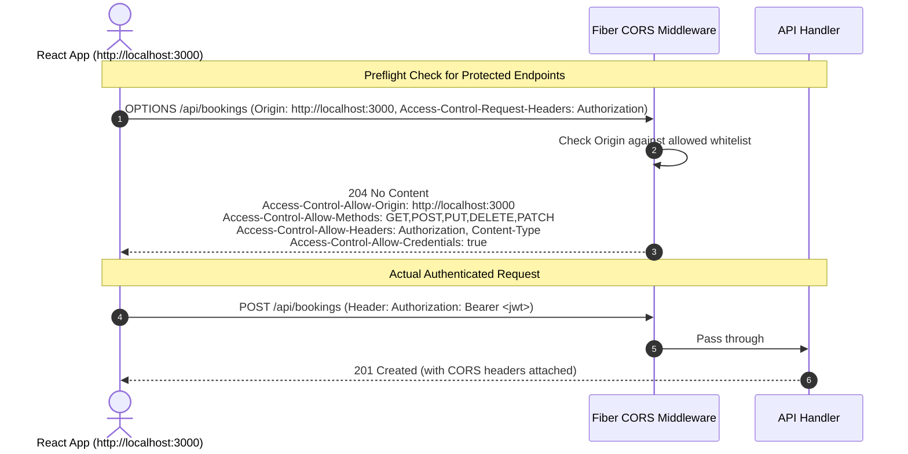

# Frontend API Integration, Swagger & Postman Guide

This document provides the frontend integration guidelines for the **React development team**, including standardized envelopes, error structures, Swagger/OpenAPI documentation, CORS setup, pagination standards, and Postman collection details.

---

## 1. Standardized JSON Envelope Format

All RESTful endpoints strictly adhere to a consistent root JSON structure.

### 1.1 Success Response (`200 OK`, `201 Created`)
```json
{
  "status": "success",
  "message": "Booking created successfully",
  "data": {
    "id": 1,
    "booking_reference": "BK-2026-7A8B9C",
    "room_id": 101,
    "total_price": 240.00,
    "status": "confirmed"
  },
  "errors": null
}
```

### 1.2 Paginated List Response (`200 OK`)
```json
{
  "status": "success",
  "message": "Rooms retrieved successfully",
  "data": {
    "items": [
      {
        "id": 1,
        "number": "101",
        "price": 80.00,
        "status": "available"
      }
    ],
    "pagination": {
      "total_count": 48,
      "page": 1,
      "limit": 10,
      "total_pages": 5
    }
  },
  "errors": null
}
```

### 1.3 Error Response (`400 Bad Request`, `401 Unauthorized`, `403 Forbidden`, `409 Conflict`)
```json
{
  "status": "error",
  "message": "Validation failed",
  "data": null,
  "errors": [
    {
      "field": "check_out_date",
      "message": "check_out_date must be after check_in_date"
    },
    {
      "field": "guest_id",
      "message": "guest_id is required"
    }
  ]
}
```

---

## 2. HTTP Status Codes & Error Mapping

| HTTP Code | Constant Name | Condition |
|---|---|---|
| **`200 OK`** | `StatusOK` | Successful retrieval, status patch, or update |
| **`201 Created`** | `StatusCreated` | Resource successfully inserted (`POST /bookings`, `POST /guests`, etc.) |
| **`400 Bad Request`** | `StatusBadRequest` | Malformed JSON body, failing field validators, or date logic errors |
| **`401 Unauthorized`**| `StatusUnauthorized` | Missing or invalid `Bearer <token>` in `Authorization` header |
| **`403 Forbidden`** | `StatusForbidden` | User lacks role privilege (e.g. Housekeeper accessing Revenue) |
| **`404 Not Found`** | `StatusNotFound` | Requested resource ID does not exist |
| **`409 Conflict`** | `StatusConflict` | Room already booked for the selected dates |
| **`429 Too Many Requests`** | `StatusTooManyRequests` | Rate limit quota exceeded |
| **`500 Internal Server Error`** | `StatusInternalServerError` | Uncaught system exception |

---

## 3. CORS Architecture Flow



---

## 4. Swagger UI & OpenAPI Specification

The API supports Swagger/OpenAPI doc generation via `swaggo/swag` and `@gofiber/swagger`.

### 4.1 Accessing Interactive Swagger Docs
- **Swagger Web UI**: `http://localhost:8080/swagger/index.html`
- **Raw OpenAPI JSON**: `http://localhost:8080/swagger/doc.json`

### 4.2 Interactive Swagger UI Layout Diagram
```
┌─────────────────────────────────────────────────────────────────────────────┐
│  Hotel Management System RESTful API v1.0.0               [Authorize 🔒]    │
│  Base URL: /api                                                             │
├─────────────────────────────────────────────────────────────────────────────┤
│  ▼ Auth                                                                     │
│    POST  /api/auth/login        Authenticate staff and receive JWT token    │
│    POST  /api/auth/register     Create a new staff member (Admin)           │
│    POST  /api/auth/logout       Invalidate session                          │
├─────────────────────────────────────────────────────────────────────────────┤
│  ▼ Rooms                                                                    │
│    GET   /api/rooms             List all rooms with query filtering         │
│    GET   /api/rooms/available   Check room availability by date range       │
│    POST  /api/rooms             Add a new physical room (Admin)             │
│    PUT   /api/rooms/{id}        Update room details                         │
│    PATCH /api/rooms/{id}/status Update room status (Housekeeping / Staff)   │
├─────────────────────────────────────────────────────────────────────────────┤
│  ▼ Bookings                                                                 │
│    POST  /api/bookings          Create a new reservation                    │
│    POST  /api/check-in/{id}     Process guest check-in (marks room occupied)│
│    POST  /api/check-out/{id}    Process check-out & generate invoice        │
│    DELETE/api/bookings/{id}     Cancel reservation                          │
├─────────────────────────────────────────────────────────────────────────────┤
│  ▼ Reports                                                                  │
│    GET   /api/reports/revenue   Revenue analytics by timeframe & method     │
│    GET   /api/reports/occupancy Room occupancy rate percentages             │
└─────────────────────────────────────────────────────────────────────────────┘
```

---

## 5. Postman Collection for Testing

A ready-to-import Postman Collection file `docs/hotel_api_postman_collection.json` is provided in the repository with pre-configured requests, environment tokens, and test scripts.
