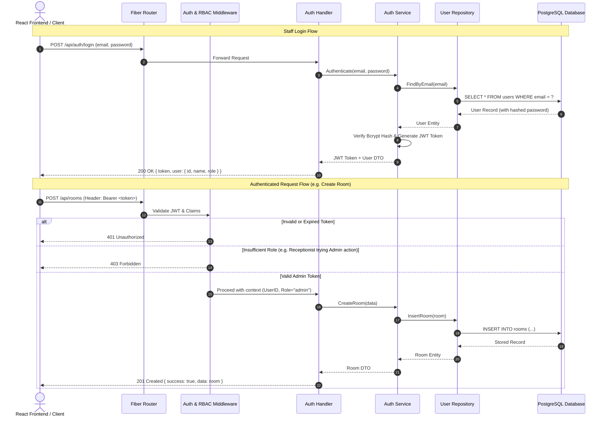

# Hotel Management System - Complete API Endpoints Specification

Base URL: `http://localhost:8080/api`

---

## 1. Authentication Flow Diagram



---

## 2. API Endpoints Master Catalog

| Module | Method | Path | Access / Role | Description |
|---|---|---|---|---|
| **Auth** | `POST` | `/api/auth/register` | `Admin` | Create a new staff account with assigned role |
| **Auth** | `POST` | `/api/auth/login` | `Public` | Staff login, returns JWT token & user profile |
| **Auth** | `POST` | `/api/auth/logout` | `Protected` | Invalidate client session token |
| **Rooms** | `GET` | `/api/rooms` | `Protected` | List rooms (filterable by `status`, `type_id`, `floor`) |
| **Rooms** | `GET` | `/api/rooms/:id` | `Protected` | Get details of a specific room |
| **Rooms** | `POST` | `/api/rooms` | `Admin` | Add a new room |
| **Rooms** | `PUT` | `/api/rooms/:id` | `Admin` | Update room number, price, type, or status |
| **Rooms** | `DELETE` | `/api/rooms/:id` | `Admin` | Decommission / delete room |
| **Guests** | `GET` | `/api/guests` | `Admin, Receptionist` | List all guests (with search query) |
| **Guests** | `GET` | `/api/guests/:id` | `Admin, Receptionist` | Get guest profile & reservation history |
| **Guests** | `POST` | `/api/guests` | `Admin, Receptionist` | Register a new guest profile |
| **Guests** | `PUT` | `/api/guests/:id` | `Admin, Receptionist` | Update guest contact or identity details |
| **Bookings** | `GET` | `/api/bookings` | `Admin, Receptionist` | List bookings (filterable by status, guest, dates) |
| **Bookings** | `GET` | `/api/bookings/:id` | `Admin, Receptionist` | Get full booking details & invoice status |
| **Bookings** | `POST` | `/api/bookings` | `Admin, Receptionist` | Create a new booking reservation |
| **Bookings** | `PUT` | `/api/bookings/:id` | `Admin, Receptionist` | Update booking dates or room allocation |
| **Bookings** | `DELETE`| `/api/bookings/:id` | `Admin, Receptionist` | Cancel booking and release room |
| **Bookings** | `GET` | `/api/bookings/available-rooms` | `Protected` | Check room availability for date range (`check_in`, `check_out`) |
| **Operations** | `POST` | `/api/check-in/:bookingId` | `Admin, Receptionist` | Check-in guest, mark room `occupied` |
| **Operations** | `POST` | `/api/check-out/:bookingId` | `Admin, Receptionist` | Check-out guest, mark room `cleaning`, generate invoice |
| **Reports** | `GET` | `/api/reports/occupancy` | `Admin, Receptionist` | Real-time & historical occupancy percentages |
| **Reports** | `GET` | `/api/reports/revenue` | `Admin` | Total revenue, breakdown by payment method & timeframe |

---

## 3. Standard JSON Response Envelopes & HTTP Status Codes

### Standard Response Envelope
```json
{
  "success": true,
  "message": "Operation completed successfully",
  "data": {},
  "error": null
}
```

### Standard Error Response Envelope
```json
{
  "success": false,
  "message": "Validation failed / Resource not found",
  "data": null,
  "error": "Detailed error message"
}
```

### HTTP Status Code Usage Matrix
- **`200 OK`**: Successful `GET`, `PUT`, or non-creation `POST` action.
- **`201 Created`**: Successful resource creation (`POST /api/bookings`, `POST /api/rooms`).
- **`400 Bad Request`**: Malformed JSON, missing required fields, invalid date formats.
- **`401 Unauthorized`**: Missing, invalid, or expired JWT Bearer token.
- **`403 Forbidden`**: Valid token, but staff role lacks sufficient privileges (e.g. Housekeeper accessing Revenue).
- **`404 Not Found`**: Resource ID (room, booking, guest) does not exist.
- **`409 Conflict`**: Room already booked for the selected date range.
- **`500 Internal Server Error`**: Unexpected database or server errors.

---

## 4. Detailed JSON Request/Response Schemas

### 4.1 Authentication Module

#### `POST /api/auth/register`
- **Access**: `Admin` only
- **Request Body**:
```json
{
  "name": "Sarah Receptionist",
  "email": "sarah@hotel.com",
  "password": "SecurePassword123!",
  "role": "receptionist"
}
```
- **Response (201 Created)**:
```json
{
  "success": true,
  "message": "Staff account registered successfully",
  "data": {
    "id": 4,
    "name": "Sarah Receptionist",
    "email": "sarah@hotel.com",
    "role": "receptionist",
    "is_active": true,
    "created_at": "2026-08-16T14:30:00Z"
  }
}
```

#### `POST /api/auth/login`
- **Access**: `Public`
- **Request Body**:
```json
{
  "email": "admin@hotel.com",
  "password": "Admin@123456"
}
```
- **Response (200 OK)**:
```json
{
  "success": true,
  "message": "Login successful",
  "data": {
    "token": "eyJhbGciOiJIUzI1NiIsInR5cCI6IkpXVCJ9...",
    "user": {
      "id": 1,
      "name": "System Administrator",
      "email": "admin@hotel.com",
      "role": "admin"
    }
  }
}
```

#### `POST /api/auth/logout`
- **Access**: `Protected`
- **Response (200 OK)**:
```json
{
  "success": true,
  "message": "Successfully logged out"
}
```

---

### 4.2 Room Management

#### `GET /api/rooms`
- **Access**: `Protected`
- **Query Params**: `status` (available, occupied, cleaning, maintenance), `room_type_id`, `floor`
- **Response (200 OK)**:
```json
{
  "success": true,
  "data": [
    {
      "id": 1,
      "number": "101",
      "room_type_id": 1,
      "room_type": {
        "id": 1,
        "name": "Single Standard",
        "base_price": 80.00,
        "capacity": 1
      },
      "price": 80.00,
      "floor": 1,
      "status": "available",
      "is_active": true
    }
  ]
}
```

#### `POST /api/rooms`
- **Access**: `Admin` only
- **Request Body**:
```json
{
  "number": "302",
  "room_type_id": 3,
  "price": 280.00,
  "floor": 3,
  "status": "available"
}
```
- **Response (201 Created)**:
```json
{
  "success": true,
  "message": "Room created successfully",
  "data": {
    "id": 6,
    "number": "302",
    "room_type_id": 3,
    "price": 280.00,
    "floor": 3,
    "status": "available",
    "is_active": true
  }
}
```

---

### 4.3 Guest Management

#### `POST /api/guests`
- **Access**: `Admin`, `Receptionist`
- **Request Body**:
```json
{
  "name": "Carlos Santana",
  "email": "carlos@example.com",
  "phone": "+34-91-123-4567",
  "id_number": "ID-ESP-789012",
  "address": "Gran Via 28, Madrid, Spain"
}
```
- **Response (201 Created)**:
```json
{
  "success": true,
  "message": "Guest profile registered",
  "data": {
    "id": 3,
    "name": "Carlos Santana",
    "email": "carlos@example.com",
    "phone": "+34-91-123-4567",
    "id_number": "ID-ESP-789012",
    "address": "Gran Via 28, Madrid, Spain",
    "created_at": "2026-08-16T14:35:00Z"
  }
}
```

---

### 4.4 Booking Management & Availability

#### `GET /api/bookings/available-rooms?check_in=2026-09-01&check_out=2026-09-05`
- **Access**: `Protected`
- **Response (200 OK)**:
```json
{
  "success": true,
  "message": "Available rooms retrieved",
  "data": [
    {
      "id": 1,
      "number": "101",
      "room_type": {
        "id": 1,
        "name": "Single Standard",
        "base_price": 80.00,
        "capacity": 1
      },
      "price": 80.00,
      "floor": 1,
      "status": "available"
    }
  ]
}
```

#### `POST /api/bookings`
- **Access**: `Admin`, `Receptionist`
- **Request Body**:
```json
{
  "guest_id": 1,
  "room_id": 1,
  "check_in_date": "2026-09-01",
  "check_out_date": "2026-09-05",
  "special_requests": "Late check-in at 9 PM",
  "initial_payment": {
    "amount": 160.00,
    "payment_method": "credit_card"
  }
}
```
- **Response (201 Created)**:
```json
{
  "success": true,
  "message": "Booking created successfully",
  "data": {
    "id": 4,
    "booking_reference": "BK-2026-7A8B9C",
    "guest_id": 1,
    "room_id": 1,
    "check_in_date": "2026-09-01",
    "check_out_date": "2026-09-05",
    "total_price": 320.00,
    "status": "confirmed",
    "special_requests": "Late check-in at 9 PM",
    "created_at": "2026-08-16T14:40:00Z"
  }
}
```

---

### 4.5 Check-In / Check-Out & Invoicing

#### `POST /api/check-in/:bookingId`
- **Access**: `Admin`, `Receptionist`
- **Response (200 OK)**:
```json
{
  "success": true,
  "message": "Guest checked in successfully. Room status set to 'occupied'.",
  "data": {
    "booking_id": 4,
    "booking_reference": "BK-2026-7A8B9C",
    "status": "checked-in",
    "actual_check_in": "2026-09-01T14:15:00Z",
    "room": {
      "id": 1,
      "number": "101",
      "status": "occupied"
    }
  }
}
```

#### `POST /api/check-out/:bookingId`
- **Access**: `Admin`, `Receptionist`
- **Response (200 OK)**:
```json
{
  "success": true,
  "message": "Guest checked out successfully. Room status set to 'cleaning'.",
  "data": {
    "booking_id": 4,
    "booking_reference": "BK-2026-7A8B9C",
    "status": "checked-out",
    "actual_check_out": "2026-09-05T11:00:00Z",
    "invoice": {
      "total_amount": 320.00,
      "paid_amount": 320.00,
      "balance_due": 0.00,
      "payment_status": "settled"
    },
    "room": {
      "id": 1,
      "number": "101",
      "status": "cleaning"
    }
  }
}
```

---

### 4.6 Reports & Analytics

#### `GET /api/reports/occupancy?start=2026-08-01&end=2026-08-31`
- **Access**: `Admin`, `Receptionist`
- **Response (200 OK)**:
```json
{
  "success": true,
  "data": {
    "total_rooms": 25,
    "available_rooms": 14,
    "occupied_rooms": 8,
    "cleaning_rooms": 2,
    "maintenance_rooms": 1,
    "occupancy_rate_percentage": 32.0
  }
}
```

#### `GET /api/reports/revenue?start=2026-08-01&end=2026-08-31`
- **Access**: `Admin` only
- **Response (200 OK)**:
```json
{
  "success": true,
  "data": {
    "total_revenue": 18450.00,
    "total_bookings": 54,
    "completed_stays": 48,
    "cancelled_stays": 4,
    "cash_revenue": 3400.00,
    "card_revenue": 12850.00,
    "transfer_revenue": 2200.00
  }
}
```
