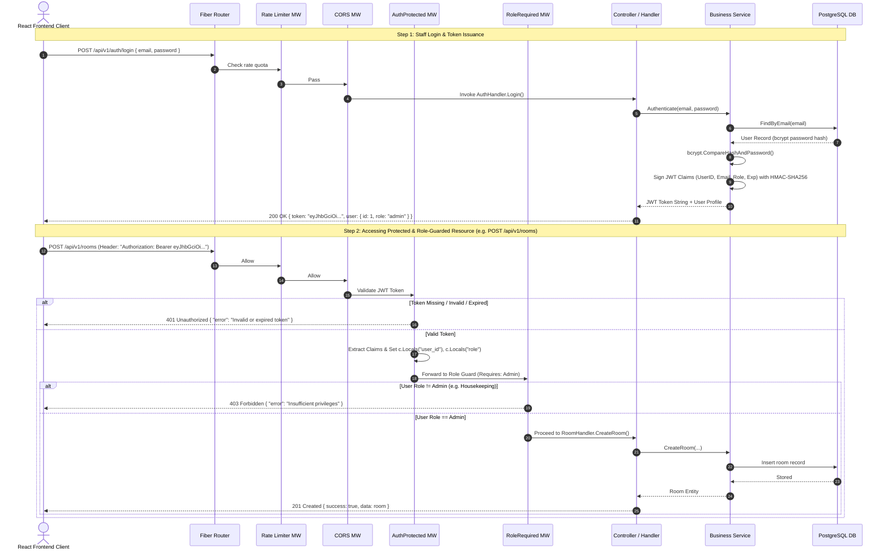
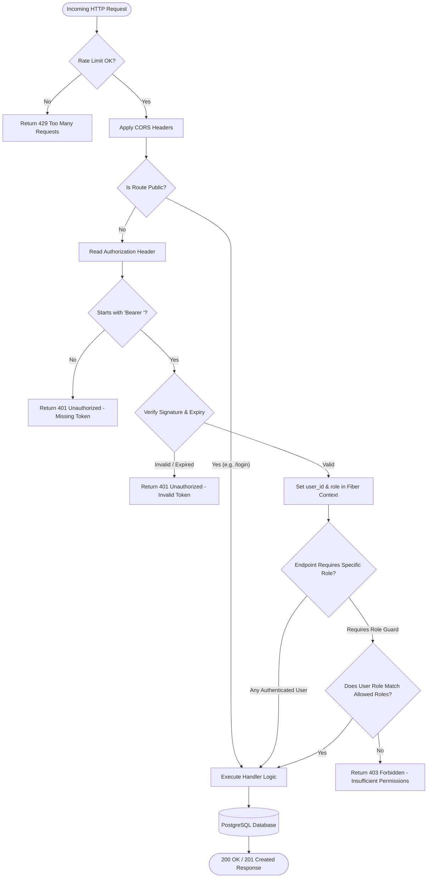

# Authentication & Authorization (RBAC) Architecture & Design

This document details the security architecture, JSON Web Token (JWT) lifecycle, Role-Based Access Control (RBAC), middleware chaining order, and decision flow charts for the **Hotel Management System**.

---

## 1. End-to-End Authentication & Authorization Lifecycle Flow



---

## 2. JWT Payload & Claims Structure

Tokens are signed using `HMAC-SHA256` (`HS256`) with a cryptographically secure key stored in environment variables (`JWT_SECRET`).

### 2.1 Go Struct Definition
```go
package utils

import (
	"github.com/golang-jwt/jwt/v5"
)

type JWTClaims struct {
	UserID uint   `json:"user_id"`
	Email  string `json:"email"`
	Role   string `json:"role"` // "admin" | "receptionist" | "housekeeping"
	jwt.RegisteredClaims
}
```

### 2.2 Decoded JWT Structure Breakdown
```json
// Header
{
  "alg": "HS256",
  "typ": "JWT"
}

// Payload (Claims)
{
  "user_id": 1,
  "email": "admin@hotel.com",
  "role": "admin",
  "iss": "hotel-management-system",
  "sub": "1",
  "exp": 1786982400,
  "nbf": 1786896000,
  "iat": 1786896000
}
```

---

## 3. Role-Based Access Control (RBAC) Permission Matrix

| Endpoint Route | HTTP Method | Public | Authenticated | Housekeeping | Receptionist | Admin |
|---|:---:|:---:|:---:|:---:|:---:|:---:|
| `/api/v1/auth/login` | `POST` | ✅ | ✅ | ✅ | ✅ | ✅ |
| `/api/v1/auth/me` | `GET` | ❌ | ✅ | ✅ | ✅ | ✅ |
| `/api/v1/staff/*` | `CRUD` | ❌ | ❌ | ❌ | ❌ | ✅ |
| `/api/v1/room-types` | `GET` | ❌ | ✅ | ✅ | ✅ | ✅ |
| `/api/v1/room-types` | `POST/PUT/DEL` | ❌ | ❌ | ❌ | ❌ | ✅ |
| `/api/v1/rooms` | `GET` | ❌ | ✅ | ✅ | ✅ | ✅ |
| `/api/v1/rooms` | `POST/PUT/DEL` | ❌ | ❌ | ❌ | ❌ | ✅ |
| `/api/v1/rooms/:id/status` | `PATCH` | ❌ | ✅ | ✅ | ✅ | ✅ |
| `/api/v1/guests/*` | `ALL` | ❌ | ❌ | ❌ | ✅ | ✅ |
| `/api/v1/bookings/*` | `ALL` | ❌ | ❌ | ❌ | ✅ | ✅ |
| `/api/v1/reports/occupancy` | `GET` | ❌ | ❌ | ❌ | ✅ | ✅ |
| `/api/v1/reports/revenue` | `GET` | ❌ | ❌ | ❌ | ❌ | ✅ |

---

## 4. Authorization Decision Flow Chart



---

## 5. Middleware Pipeline & Execution Order

Each HTTP request traverses an ordered pipeline of Fiber middlewares before reaching the business handler:

```
 Incoming Request
        │
        ▼
 ┌────────────────────────┐
 │   1. Recover Middleware │ -> Catches panics and prevents server crashes
 └──────────┬─────────────┘
            ▼
 ┌────────────────────────┐
 │   2. Logger Middleware  │ -> Logs HTTP method, status, path, and latency
 └──────────┬─────────────┘
            ▼
 ┌────────────────────────┐
 │    3. CORS Middleware   │ -> Validates origin, headers, and preflight OPTIONS
 └──────────┬─────────────┘
            ▼
 ┌────────────────────────┐
 │ 4. Limiter Middleware   │ -> Protects against brute-force / DDoS attacks
 └──────────┬─────────────┘
            ▼
 ┌────────────────────────┐
 │ 5. AuthProtected Guard  │ -> Validates JWT token from Authorization header
 └──────────┬─────────────┘
            ▼
 ┌────────────────────────┐
 │ 6. RoleRequired Guard   │ -> Checks user role against whitelist (e.g. Admin)
 └──────────┬─────────────┘
            ▼
 ┌────────────────────────┐
 │   7. Target Handler     │ -> Executes controller, invokes service & database
 └────────────────────────┘
```

---

## 6. Security Hardening Measures

1. **Password Security**:
   - Stored using **Bcrypt** (`golang.org/x/crypto/bcrypt`) with a minimum cost of `10`.
   - Plaintext passwords are never saved, logged, or serialized in JSON responses (`json:"-"`).
2. **Stateless JWT Verification**:
   - Server validates cryptographic signature on every request without database lookup overhead.
   - Standard 24-hour expiration window configured via `JWT_EXPIRATION_HOURS`.
3. **Role Context Storage**:
   - `c.Locals("user_id", claims.UserID)` and `c.Locals("role", claims.Role)` provide type-safe access in controllers without re-decoding tokens.
4. **CORS Whitelisting**:
   - Restricts API access to authorized frontend origins (e.g. React single-page application).
5. **Role Segregation**:
   - Housekeeping staff can exclusively modify room maintenance and cleaning states.
   - Front desk staff can perform customer intake, bookings, and check-in/out.
   - Financial revenue and staff account administration remain restricted to administrators.
