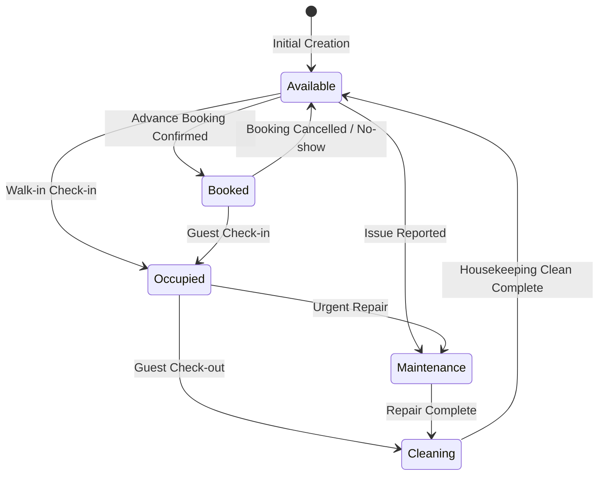
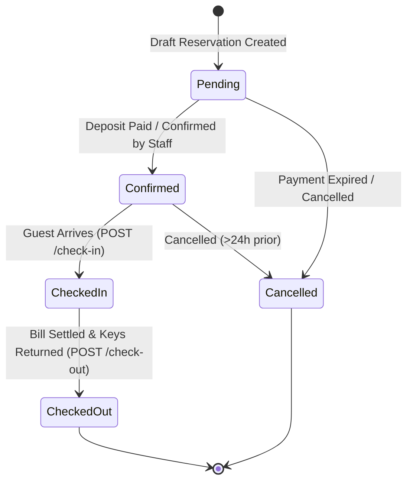
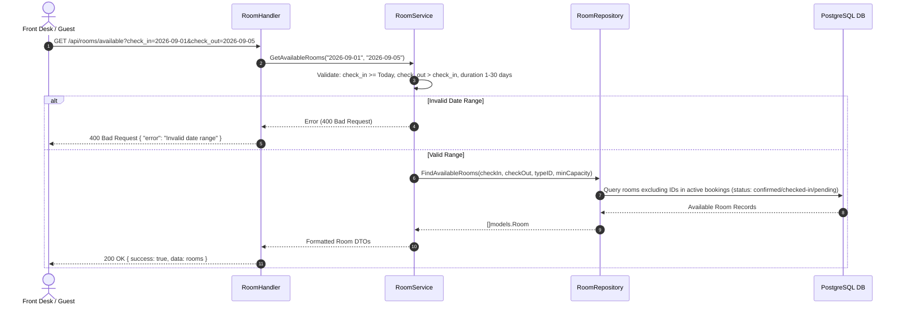
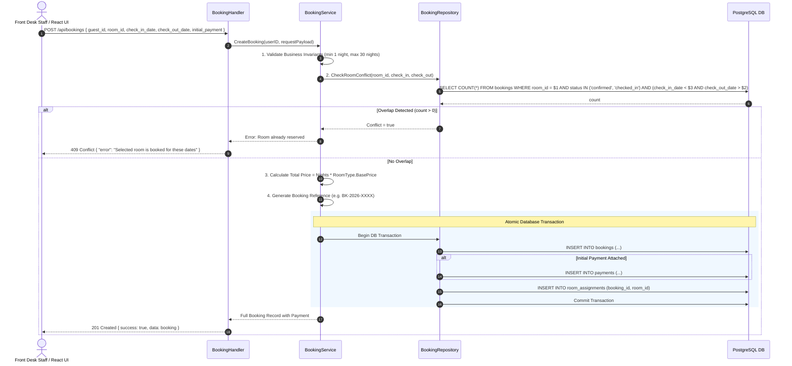
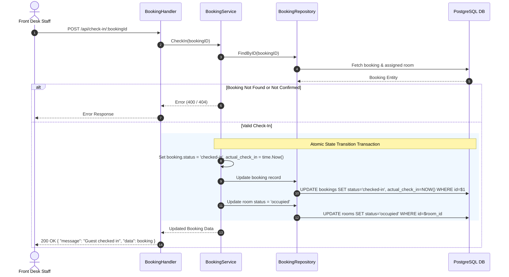
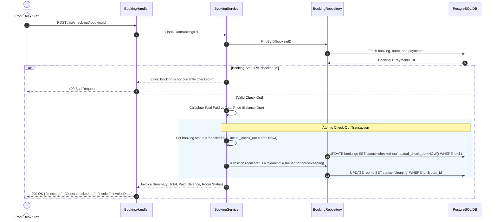

# Business Logic Architecture & Operational Plan

This document details the business logic, state machines, validation rules, transaction management, and sequence workflows for the **Hotel Management System Service Layer**.

---

## 1. Core State Machines & Lifecycles

### 1.1 Room Status Lifecycle State Diagram

### 1.2 Booking Status Lifecycle State Diagram

---

## 2. Sequence Diagrams for Core Business Operations

### 2.1 Checking Room Availability Flow

---

### 2.2 Creating a New Booking Flow (Concurrency & Double-Booking Prevention)

---

### 2.3 Check-In Process Flow

---

### 2.4 Check-Out & Invoice Generation Flow

---

## 3. Hotel Business Rules & Validation Invariants

| Invariant / Rule | Constraint | Enforcement Point |
|---|---|---|
| **Minimum Stay** | 1 night minimum stay required | `BookingService.CreateBooking` / `UpdateBooking` |
| **Maximum Stay** | 30 nights maximum duration per single reservation | `BookingService.CreateBooking` |
| **Check-in Standard Window** | Standard check-in starts at `14:00 (2:00 PM)` | Front desk business rules & notifications |
| **Check-out Standard Window**| Standard check-out deadline is `12:00 (12:00 PM)` | Late checkout flag if timestamp > 12:00 PM |
| **Cancellation Policy** | Cancellations permitted without penalty if $\ge 24\text{ hours}$ before check-in date | `BookingService.CancelBooking` |
| **Double-Booking Guarantee** | No overlapping active bookings for the same room | DB Overlap Query + ACID Transactions |
| **Housekeeping Turnaround** | Checking out automatically changes room to `cleaning` | `BookingService.CheckOut` |
| **Occupancy Access** | Rooms in `maintenance` status are excluded from available listings | `RoomRepository.FindAvailableRooms` |
