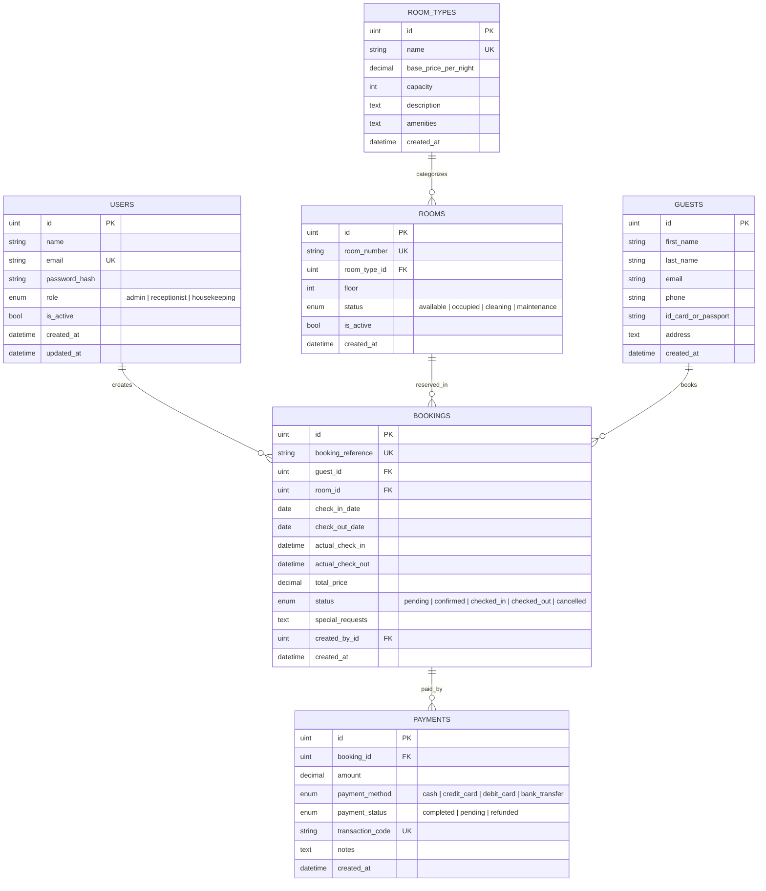

# Database Schema & Entity Design

## 1. Entity Relationship (ER) Diagram

---

## 2. Integrity & Concurrency Rules

1. **Room Availability Conflict Guarantee**:
   - A room cannot have overlapping bookings if its status is in (`confirmed`, `checked_in`, `pending`).
   - Overlap query rule: `booking.check_in_date < RequestedCheckOut AND booking.check_out_date > RequestedCheckIn`.
2. **State Transition Lifecycle**:
   - **Booking Creation** $\rightarrow$ Status: `confirmed`.
   - **Check-in** $\rightarrow$ Booking: `checked_in`, Room: `occupied`, sets `actual_check_in`.
   - **Check-out** $\rightarrow$ Booking: `checked_out`, Room: `cleaning`, sets `actual_check_out`.
   - **Housekeeping Finish** $\rightarrow$ Room: `available`.
   - **Cancellation** $\rightarrow$ Booking: `cancelled`, Room: released to `available`.
3. **Cascade & Deletion Safeguards**:
   - Soft deletes (`gorm.DeletedAt`) preserve historical reports and audits.
   - Deleting a room type is protected if active rooms reference it.
