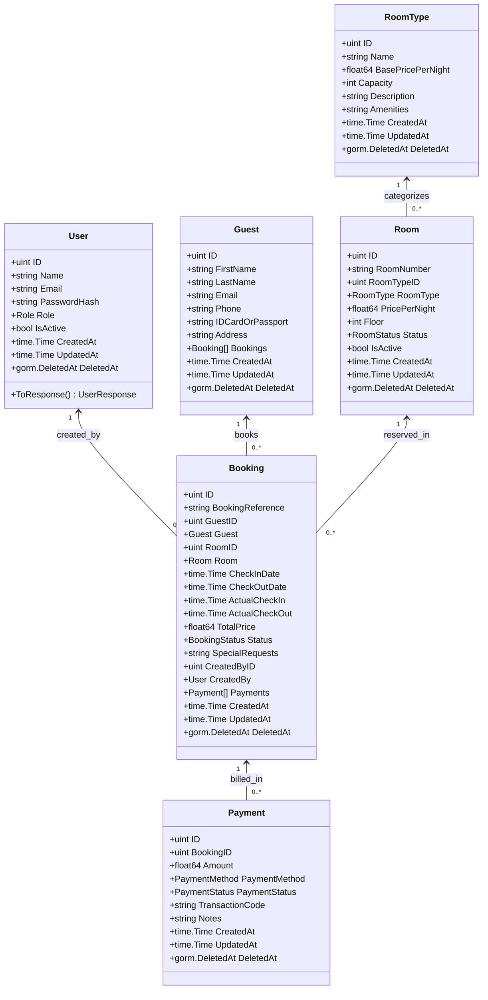
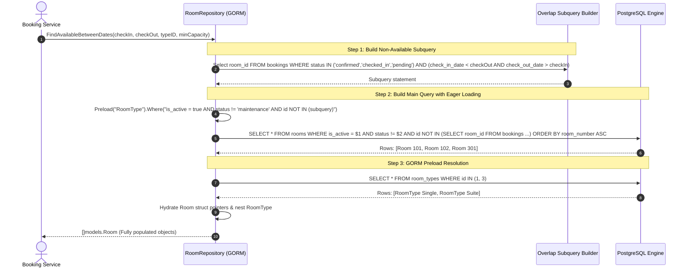

# Database Implementation Plan with GORM

This document outlines the implementation plan for database persistence using **GORM** (Go Object-Relational Mapping), including struct tags, relationship mapping, repository interfaces with method signatures, migration strategies, and query execution flows.

---

## 1. UML Class & Entity Model Diagram



---

## 2. GORM Models with Comprehensive Struct Tags

### 2.1 User Model
```go
package models

import (
	"time"
	"gorm.io/gorm"
)

type Role string

const (
	RoleAdmin        Role = "admin"
	RoleReceptionist Role = "receptionist"
	RoleHousekeeping Role = "housekeeping"
)

type User struct {
	ID           uint           `gorm:"primaryKey;autoIncrement" json:"id"`
	Name         string         `gorm:"type:varchar(100);not null" json:"name" validate:"required,min=2,max=100"`
	Email        string         `gorm:"type:varchar(150);uniqueIndex;not null" json:"email" validate:"required,email"`
	PasswordHash string         `gorm:"type:varchar(255);not null" json:"-"`
	Role         Role           `gorm:"type:varchar(30);default:'receptionist';not null;index" json:"role" validate:"required,oneof=admin receptionist housekeeping"`
	IsActive     bool           `gorm:"default:true;not null" json:"is_active"`
	CreatedAt    time.Time      `gorm:"autoCreateTime" json:"created_at"`
	UpdatedAt    time.Time      `gorm:"autoUpdateTime" json:"updated_at"`
	DeletedAt    gorm.DeletedAt `gorm:"index" json:"-"`
}
```

### 2.2 Room & RoomType Models
```go
package models

import (
	"time"
	"gorm.io/gorm"
)

type RoomStatus string

const (
	RoomStatusAvailable   RoomStatus = "available"
	RoomStatusBooked      RoomStatus = "booked"
	RoomStatusOccupied    RoomStatus = "occupied"
	RoomStatusCleaning    RoomStatus = "cleaning"
	RoomStatusMaintenance RoomStatus = "maintenance"
)

type RoomType struct {
	ID                uint           `gorm:"primaryKey;autoIncrement" json:"id"`
	Name              string         `gorm:"type:varchar(100);uniqueIndex;not null" json:"name" validate:"required"`
	BasePricePerNight float64        `gorm:"type:decimal(10,2);not null" json:"base_price_per_night" validate:"required,gt=0"`
	Capacity          int            `gorm:"type:int;not null" json:"capacity" validate:"required,gt=0"`
	Description       string         `gorm:"type:text" json:"description"`
	Amenities         string         `gorm:"type:text" json:"amenities"`
	CreatedAt         time.Time      `gorm:"autoCreateTime" json:"created_at"`
	UpdatedAt         time.Time      `gorm:"autoUpdateTime" json:"updated_at"`
	DeletedAt         gorm.DeletedAt `gorm:"index" json:"-"`
}

type Room struct {
	ID            uint           `gorm:"primaryKey;autoIncrement" json:"id"`
	RoomNumber    string         `gorm:"type:varchar(20);uniqueIndex;not null" json:"room_number" validate:"required"`
	RoomTypeID    uint           `gorm:"not null;index" json:"room_type_id" validate:"required"`
	RoomType      *RoomType      `gorm:"foreignKey:RoomTypeID;constraint:OnUpdate:CASCADE,OnDelete:RESTRICT;" json:"room_type,omitempty"`
	PricePerNight float64        `gorm:"type:decimal(10,2);not null" json:"price_per_night" validate:"required,gt=0"`
	Floor         int            `gorm:"not null" json:"floor" validate:"required"`
	Status        RoomStatus     `gorm:"type:varchar(30);default:'available';not null;index" json:"status" validate:"required,oneof=available booked occupied cleaning maintenance"`
	IsActive      bool           `gorm:"default:true;not null" json:"is_active"`
	CreatedAt     time.Time      `gorm:"autoCreateTime" json:"created_at"`
	UpdatedAt     time.Time      `gorm:"autoUpdateTime" json:"updated_at"`
	DeletedAt     gorm.DeletedAt `gorm:"index" json:"-"`
}
```

### 2.3 Guest Model
```go
package models

import (
	"time"
	"gorm.io/gorm"
)

type Guest struct {
	ID               uint           `gorm:"primaryKey;autoIncrement" json:"id"`
	FirstName        string         `gorm:"type:varchar(100);not null" json:"first_name" validate:"required"`
	LastName         string         `gorm:"type:varchar(100);not null" json:"last_name" validate:"required"`
	Email            string         `gorm:"type:varchar(150);index;not null" json:"email" validate:"required,email"`
	Phone            string         `gorm:"type:varchar(50);not null" json:"phone" validate:"required"`
	IDCardOrPassport string         `gorm:"type:varchar(100);index;not null" json:"id_card_or_passport" validate:"required"`
	Address          string         `gorm:"type:text" json:"address"`
	Bookings         []Booking      `gorm:"foreignKey:GuestID;constraint:OnUpdate:CASCADE,OnDelete:RESTRICT;" json:"bookings,omitempty"`
	CreatedAt        time.Time      `gorm:"autoCreateTime" json:"created_at"`
	UpdatedAt        time.Time      `gorm:"autoUpdateTime" json:"updated_at"`
	DeletedAt        gorm.DeletedAt `gorm:"index" json:"-"`
}
```

### 2.4 Booking & Payment Models
```go
package models

import (
	"time"
	"gorm.io/gorm"
)

type BookingStatus string

const (
	BookingStatusPending    BookingStatus = "pending"
	BookingStatusConfirmed  BookingStatus = "confirmed"
	BookingStatusCheckedIn  BookingStatus = "checked_in"
	BookingStatusCheckedOut BookingStatus = "checked_out"
	BookingStatusCancelled  BookingStatus = "cancelled"
)

type Booking struct {
	ID               uint           `gorm:"primaryKey;autoIncrement" json:"id"`
	BookingReference string         `gorm:"type:varchar(50);uniqueIndex;not null" json:"booking_reference"`
	GuestID          uint           `gorm:"not null;index" json:"guest_id" validate:"required"`
	Guest            *Guest         `gorm:"foreignKey:GuestID;constraint:OnUpdate:CASCADE,OnDelete:RESTRICT;" json:"guest,omitempty"`
	RoomID           uint           `gorm:"not null;index" json:"room_id" validate:"required"`
	Room             *Room          `gorm:"foreignKey:RoomID;constraint:OnUpdate:CASCADE,OnDelete:RESTRICT;" json:"room,omitempty"`
	CheckInDate      time.Time      `gorm:"type:date;not null;index" json:"check_in_date" validate:"required"`
	CheckOutDate     time.Time      `gorm:"type:date;not null;index" json:"check_out_date" validate:"required,gtfield=CheckInDate"`
	ActualCheckIn    *time.Time     `gorm:"type:timestamptz" json:"actual_check_in,omitempty"`
	ActualCheckOut   *time.Time     `gorm:"type:timestamptz" json:"actual_check_out,omitempty"`
	TotalPrice       float64        `gorm:"type:decimal(10,2);not null" json:"total_price" validate:"required,gte=0"`
	Status           BookingStatus  `gorm:"type:varchar(30);default:'confirmed';not null;index" json:"status" validate:"required"`
	SpecialRequests  string         `gorm:"type:text" json:"special_requests,omitempty"`
	CreatedByID      uint           `gorm:"not null;index" json:"created_by_id"`
	CreatedBy        *User          `gorm:"foreignKey:CreatedByID;constraint:OnUpdate:CASCADE,OnDelete:RESTRICT;" json:"created_by,omitempty"`
	Payments         []Payment      `gorm:"foreignKey:BookingID;constraint:OnUpdate:CASCADE,OnDelete:CASCADE;" json:"payments,omitempty"`
	CreatedAt        time.Time      `gorm:"autoCreateTime" json:"created_at"`
	UpdatedAt        time.Time      `gorm:"autoUpdateTime" json:"updated_at"`
	DeletedAt        gorm.DeletedAt `gorm:"index" json:"-"`
}

type PaymentMethod string
const (
	PaymentMethodCash         PaymentMethod = "cash"
	PaymentMethodCreditCard   PaymentMethod = "credit_card"
	PaymentMethodDebitCard    PaymentMethod = "debit_card"
	PaymentMethodBankTransfer PaymentMethod = "bank_transfer"
)

type PaymentStatus string
const (
	PaymentStatusPending   PaymentStatus = "pending"
	PaymentStatusCompleted PaymentStatus = "completed"
	PaymentStatusRefunded  PaymentStatus = "refunded"
)

type Payment struct {
	ID              uint           `gorm:"primaryKey;autoIncrement" json:"id"`
	BookingID       uint           `gorm:"not null;index" json:"booking_id" validate:"required"`
	Amount          float64        `gorm:"type:decimal(10,2);not null" json:"amount" validate:"required,gt=0"`
	PaymentMethod   PaymentMethod  `gorm:"type:varchar(30);not null" json:"payment_method" validate:"required"`
	PaymentStatus   PaymentStatus  `gorm:"type:varchar(30);default:'completed';not null" json:"payment_status"`
	TransactionCode string         `gorm:"type:varchar(100);uniqueIndex;not null" json:"transaction_code"`
	Notes           string         `gorm:"type:text" json:"notes,omitempty"`
	CreatedAt       time.Time      `gorm:"autoCreateTime" json:"created_at"`
	UpdatedAt       time.Time      `gorm:"autoUpdateTime" json:"updated_at"`
	DeletedAt       gorm.DeletedAt `gorm:"index" json:"-"`
}
```

---

## 3. Repository Layer Interfaces & Method Signatures

The repository layer isolates data access behind standard Go interfaces, enabling clean mock testing:

```go
package repository

import (
	"time"
	"hotel-backend/internal/models"
	"gorm.io/gorm"
)

// UserRepository specifies data operations for staff members
type UserRepository interface {
	Create(user *models.User) error
	FindByID(id uint) (*models.User, error)
	FindByEmail(email string) (*models.User, error)
	FindAll() ([]models.User, error)
	Update(user *models.User) error
	Delete(id uint) error
}

// RoomRepository specifies operations for room types and physical rooms
type RoomRepository interface {
	Create(room *models.Room) error
	FindByID(id uint) (*models.Room, error)
	FindByNumber(roomNumber string) (*models.Room, error)
	FindAll(status models.RoomStatus, floor int, roomTypeID uint) ([]models.Room, error)
	FindByStatus(status models.RoomStatus) ([]models.Room, error)
	FindAvailableBetweenDates(checkIn, checkOut time.Time, roomTypeID *uint, minCapacity *int) ([]models.Room, error)
	Update(room *models.Room) error
	UpdateStatus(id uint, status models.RoomStatus) error
	Delete(id uint) error
	
	// Room Types
	CreateRoomType(rt *models.RoomType) error
	FindAllRoomTypes() ([]models.RoomType, error)
	FindRoomTypeByID(id uint) (*models.RoomType, error)
}

// GuestRepository specifies operations for guest profiles
type GuestRepository interface {
	Create(guest *models.Guest) error
	FindByID(id uint) (*models.Guest, error)
	FindByEmail(email string) (*models.Guest, error)
	FindByIdCard(idCard string) (*models.Guest, error)
	FindAll(searchQuery string) ([]models.Guest, error)
	Update(guest *models.Guest) error
	Delete(id uint) error
}

// BookingRepository specifies operations for reservations and payments
type BookingRepository interface {
	Create(booking *models.Booking) error
	FindByID(id uint) (*models.Booking, error)
	FindByReference(ref string) (*models.Booking, error)
	FindAll(status models.BookingStatus, guestID uint, fromDate, toDate *time.Time) ([]models.Booking, error)
	FindByGuestID(guestID uint) ([]models.Booking, error)
	FindByRoomID(roomID uint) ([]models.Booking, error)
	FindActiveBookings() ([]models.Booking, error)
	FindByDateRange(start, end time.Time) ([]models.Booking, error)
	CheckRoomConflict(roomID uint, checkIn, checkOut time.Time, excludeBookingID uint) (bool, error)
	Update(booking *models.Booking) error
	Cancel(id uint) error
	
	// Payments
	CreatePayment(payment *models.Payment) error
	FindPaymentsByBooking(bookingID uint) ([]models.Payment, error)
	GetDB() *gorm.DB
}
```

---

## 4. Query Execution Flow Diagram

The diagram below illustrates how GORM builds and executes parameterized SQL queries (e.g. `FindAvailableBetweenDates`):



---

## 5. Migration & Seeding Strategy

```
                          ┌────────────────────────┐
                          │ Database Migration Plan│
                          └───────────┬────────────┘
                                      │
               ┌──────────────────────┴──────────────────────┐
               ▼                                             ▼
    [Development / Testing]                         [Production]
    - GORM AutoMigrate                              - Versioned SQL Scripts
    - Automatically syncs struct changes             (e.g., migrations/001_*.sql)
    - Fast feedback during iteration                - Executed via Flyway / Goose
    - Runs seeder.go on startup                     - Strict rollback protection
```

1. **Development & Prototyping (GORM AutoMigrate)**:
   - Uses `db.AutoMigrate(&models.User{}, &models.RoomType{}, &models.Room{}, &models.Guest{}, &models.Booking{}, &models.Payment{})`.
   - Automatically adds missing tables, foreign key constraints, and columns without dropping data.
2. **Production Schema Versioning**:
   - Stored in `./migrations/001_initial_schema.sql` and `./migrations/002_seed_data.sql`.
   - Executed deterministically upon container initialization in PostgreSQL's `/docker-entrypoint-initdb.d`.
3. **Automated Seeding**:
   - Initial administrative user (`admin@hotel.com`), standard room categories, and initial room records are idempotently created if no matching records exist (`ON CONFLICT DO NOTHING`).
