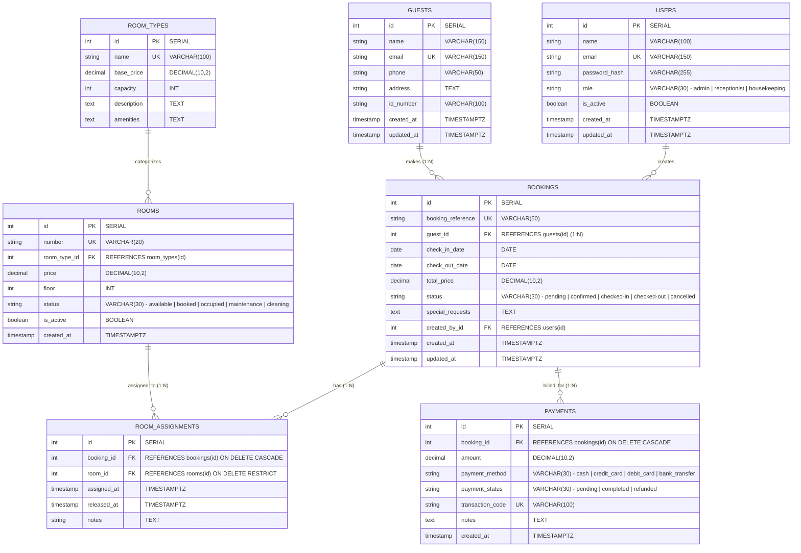

# Comprehensive Hotel Management System - Database Schema Design

This document details the complete relational database schema design for the **Hotel Management System**, adhering to 3NF (Third Normal Form), ACID relational constraints, indexing strategies for high-frequency queries, and explicit room-assignment tracking.

---

## 1. Entity-Relationship Diagram (ERD)



---

## 2. Detailed Table Specifications & Constraints

### 1. `users` (Staff Accounts & Roles)
Stores system operators with Role-Based Access Control (RBAC).

| Column Name | Data Type | Constraints | Description |
|---|---|---|---|
| `id` | `SERIAL` | `PRIMARY KEY` | Unique staff identifier |
| `name` | `VARCHAR(100)` | `NOT NULL` | Full name of staff member |
| `email` | `VARCHAR(150)` | `UNIQUE`, `NOT NULL` | Staff login email address |
| `password_hash` | `VARCHAR(255)` | `NOT NULL` | Bcrypt hashed password |
| `role` | `VARCHAR(30)` | `NOT NULL`, `CHECK (role IN ('admin', 'receptionist', 'housekeeping'))` | Authorization role |
| `is_active` | `BOOLEAN` | `DEFAULT TRUE`, `NOT NULL` | Account status flag |
| `created_at` | `TIMESTAMPTZ` | `DEFAULT CURRENT_TIMESTAMP` | Record creation timestamp |
| `updated_at` | `TIMESTAMPTZ` | `DEFAULT CURRENT_TIMESTAMP` | Record update timestamp |

**Indexes:**
- `idx_users_email` ON `users(email)` (Unique lookup index).
- `idx_users_role` ON `users(role)`.

---

### 2. `guests` (Customer Information)
Stores profile and identity verification details of hotel customers.

| Column Name | Data Type | Constraints | Description |
|---|---|---|---|
| `id` | `SERIAL` | `PRIMARY KEY` | Unique customer ID |
| `name` | `VARCHAR(150)` | `NOT NULL` | Guest full name |
| `email` | `VARCHAR(150)` | `NOT NULL` | Guest contact email |
| `phone` | `VARCHAR(50)` | `NOT NULL` | Contact telephone number |
| `address` | `TEXT` | `NULL` | Residential / billing address |
| `id_number` | `VARCHAR(100)` | `NOT NULL` | National ID / Passport number |
| `created_at` | `TIMESTAMPTZ` | `DEFAULT CURRENT_TIMESTAMP` | Registration date |
| `updated_at` | `TIMESTAMPTZ` | `DEFAULT CURRENT_TIMESTAMP` | Last updated date |

**Indexes:**
- `idx_guests_email` ON `guests(email)` (High-frequency search).
- `idx_guests_id_number` ON `guests(id_number)` (Check-in lookup).
- `idx_guests_phone` ON `guests(phone)`.

---

### 3. `room_types` (Room Categories)
Defines room classes, standard capacities, and default nightly base rates.

| Column Name | Data Type | Constraints | Description |
|---|---|---|---|
| `id` | `SERIAL` | `PRIMARY KEY` | Unique type ID |
| `name` | `VARCHAR(100)` | `UNIQUE`, `NOT NULL` | Type name (e.g. Single, Double, Suite) |
| `base_price` | `DECIMAL(10,2)` | `NOT NULL`, `CHECK (base_price > 0)` | Standard nightly rate |
| `capacity` | `INT` | `NOT NULL`, `CHECK (capacity > 0)` | Max guest occupancy |
| `description` | `TEXT` | `NULL` | Overview of category |
| `amenities` | `TEXT` | `NULL` | Feature list (Wi-Fi, AC, Balcony, etc.) |

---

### 4. `rooms` (Physical Room Details & Status)
Represents physical rooms in the building.

| Column Name | Data Type | Constraints | Description |
|---|---|---|---|
| `id` | `SERIAL` | `PRIMARY KEY` | Unique physical room ID |
| `number` | `VARCHAR(20)` | `UNIQUE`, `NOT NULL` | Room number (e.g. '101', '204B') |
| `room_type_id` | `INT` | `NOT NULL`, `REFERENCES room_types(id) ON DELETE RESTRICT` | FK referencing room category |
| `price` | `DECIMAL(10,2)` | `NOT NULL`, `CHECK (price > 0)` | Specific rate for this room |
| `floor` | `INT` | `NOT NULL` | Floor number |
| `status` | `VARCHAR(30)` | `DEFAULT 'available'`, `CHECK (status IN ('available', 'booked', 'occupied', 'maintenance', 'cleaning'))` | Current room status |
| `is_active` | `BOOLEAN` | `DEFAULT TRUE` | Active inventory flag |
| `created_at` | `TIMESTAMPTZ` | `DEFAULT CURRENT_TIMESTAMP` | Creation timestamp |

**Indexes:**
- `idx_rooms_status` ON `rooms(status)` (Frequent availability queries).
- `idx_rooms_room_type_id` ON `rooms(room_type_id)`.
- `idx_rooms_number` ON `rooms(number)` (Unique lookup).

---

### 5. `bookings` (Reservations & Lifecycles)
Represents reservations with scheduled dates, guests, and pricing.

| Column Name | Data Type | Constraints | Description |
|---|---|---|---|
| `id` | `SERIAL` | `PRIMARY KEY` | Unique booking ID |
| `booking_reference` | `VARCHAR(50)` | `UNIQUE`, `NOT NULL` | Customer reference code (e.g. BK-2026-A109) |
| `guest_id` | `INT` | `NOT NULL`, `REFERENCES guests(id) ON DELETE RESTRICT` | FK to guest placing booking |
| `check_in_date` | `DATE` | `NOT NULL` | Scheduled check-in date |
| `check_out_date` | `DATE` | `NOT NULL`, `CHECK (check_out_date > check_in_date)` | Scheduled check-out date |
| `total_price` | `DECIMAL(10,2)` | `NOT NULL`, `CHECK (total_price >= 0)` | Calculated total charge |
| `status` | `VARCHAR(30)` | `DEFAULT 'confirmed'`, `CHECK (status IN ('pending', 'confirmed', 'checked-in', 'checked-out', 'cancelled'))` | Lifecycle state |
| `special_requests` | `TEXT` | `NULL` | Custom guest notes |
| `created_by_id` | `INT` | `NOT NULL`, `REFERENCES users(id) ON DELETE RESTRICT` | FK to staff who created booking |
| `created_at` | `TIMESTAMPTZ` | `DEFAULT CURRENT_TIMESTAMP` | Reservation creation date |
| `updated_at` | `TIMESTAMPTZ` | `DEFAULT CURRENT_TIMESTAMP` | Last updated date |

**Indexes:**
- `idx_bookings_dates` ON `bookings(check_in_date, check_out_date)` (Critical for overlap checking).
- `idx_bookings_status` ON `bookings(status)`.
- `idx_bookings_guest_id` ON `bookings(guest_id)`.
- `idx_bookings_reference` ON `bookings(booking_reference)`.

---

### 6. `room_assignments` (Booking $\leftrightarrow$ Room Mapping)
Tracks which room is assigned to which reservation, including historical room reassignments or multi-room bookings.

| Column Name | Data Type | Constraints | Description |
|---|---|---|---|
| `id` | `SERIAL` | `PRIMARY KEY` | Assignment record ID |
| `booking_id` | `INT` | `NOT NULL`, `REFERENCES bookings(id) ON DELETE CASCADE` | FK to reservation |
| `room_id` | `INT` | `NOT NULL`, `REFERENCES rooms(id) ON DELETE RESTRICT` | FK to physical room |
| `assigned_at` | `TIMESTAMPTZ` | `DEFAULT CURRENT_TIMESTAMP` | Date room was allocated |
| `released_at` | `TIMESTAMPTZ` | `NULL` | Date room was vacated/reassigned |
| `notes` | `TEXT` | `NULL` | Notes (e.g. "Upgraded to Suite") |

**Indexes:**
- `idx_room_assignments_booking_id` ON `room_assignments(booking_id)`.
- `idx_room_assignments_room_id` ON `room_assignments(room_id)`.

---

### 7. `payments` (Financial Transactions)
Logs all monetary transactions associated with reservations.

| Column Name | Data Type | Constraints | Description |
|---|---|---|---|
| `id` | `SERIAL` | `PRIMARY KEY` | Transaction ID |
| `booking_id` | `INT` | `NOT NULL`, `REFERENCES bookings(id) ON DELETE CASCADE` | FK to associated booking |
| `amount` | `DECIMAL(10,2)` | `NOT NULL`, `CHECK (amount > 0)` | Payment amount |
| `payment_method` | `VARCHAR(30)` | `NOT NULL`, `CHECK (payment_method IN ('cash', 'credit_card', 'debit_card', 'bank_transfer'))` | Payment method |
| `payment_status` | `VARCHAR(30)` | `DEFAULT 'completed'`, `CHECK (payment_status IN ('pending', 'completed', 'refunded'))` | Transaction status |
| `transaction_code` | `VARCHAR(100)` | `UNIQUE`, `NOT NULL` | External gateway/receipt reference |
| `notes` | `TEXT` | `NULL` | Transaction remarks |
| `created_at` | `TIMESTAMPTZ` | `DEFAULT CURRENT_TIMESTAMP` | Transaction timestamp |

**Indexes:**
- `idx_payments_booking_id` ON `payments(booking_id)`.
- `idx_payments_created_at` ON `payments(created_at)` (High-frequency revenue analytics).

---

## 3. Relationships & Cardinality Summary

1. **`guests` $\xrightarrow{1:N}$ `bookings`**: One guest can have multiple past, present, and future bookings.
2. **`bookings` $\xrightarrow{1:N}$ `room_assignments` $\xleftarrow{N:1}$ `rooms`**: One room can be assigned to many bookings over time (and a booking tracks its assigned room).
3. **`bookings` $\xrightarrow{1:N}$ `payments`**: A booking can have multiple payment installments (e.g. deposit upon booking + balance at checkout).
4. **`room_types` $\xrightarrow{1:N}$ `rooms`**: Each room category groups multiple individual rooms.
5. **`users` $\xrightarrow{1:N}$ `bookings`**: Each booking records the staff member who processed it for audit accountability.

---

## 4. Sample Data (At least 3 records per table)

### 1. `users` Table
```sql
INSERT INTO users (id, name, email, password_hash, role, is_active) VALUES
(1, 'Alice Admin', 'admin@hotel.com', '$2a$10$w8qP44XJb...adminhash', 'admin', TRUE),
(2, 'Bob Reception', 'bob@hotel.com', '$2a$10$d8fK92La...recephash', 'receptionist', TRUE),
(3, 'Charlie Clean', 'charlie@hotel.com', '$2a$10$p1lM83Ka...cleanhash', 'housekeeping', TRUE);
```

### 2. `guests` Table
```sql
INSERT INTO guests (id, name, email, phone, address, id_number) VALUES
(1, 'John Doe', 'john.doe@email.com', '+1-555-0101', '123 Maple Ave, Springfield, USA', 'PASS-USA-987654'),
(2, 'Emma Watson', 'emma.watson@email.com', '+44-20-7946-0912', '45 Oxford St, London, UK', 'PASS-GBR-123456'),
(3, 'Carlos Santana', 'carlos.s@email.com', '+34-91-123-4567', 'Gran Via 28, Madrid, Spain', 'ID-ESP-789012');
```

### 3. `room_types` Table
```sql
INSERT INTO room_types (id, name, base_price, capacity, description, amenities) VALUES
(1, 'Single Room', 80.00, 1, 'Standard single room for solo traveler', 'Wi-Fi, AC, Work Desk, Shower'),
(2, 'Double Deluxe', 140.00, 2, 'Spacious king-bed room with balcony', 'Wi-Fi, AC, King Bed, Mini Bar, Balcony'),
(3, 'Executive Suite', 280.00, 4, 'Luxury two-room suite with private lounge', 'Wi-Fi, AC, 2 Bedrooms, Jacuzzi, Smart TV, Room Service');
```

### 4. `rooms` Table
```sql
INSERT INTO rooms (id, number, room_type_id, price, floor, status, is_active) VALUES
(1, '101', 1, 80.00, 1, 'available', TRUE),
(2, '201', 2, 140.00, 2, 'occupied', TRUE),
(3, '301', 3, 280.00, 3, 'booked', TRUE);
```

### 5. `bookings` Table
```sql
INSERT INTO bookings (id, booking_reference, guest_id, check_in_date, check_out_date, total_price, status, special_requests, created_by_id) VALUES
(1, 'BK-2026-001', 1, '2026-09-01', '2026-09-04', 240.00, 'confirmed', 'Late arrival around 8 PM', 2),
(2, 'BK-2026-002', 2, '2026-08-16', '2026-08-19', 420.00, 'checked-in', 'High floor quiet room preferred', 2),
(3, 'BK-2026-003', 3, '2026-10-10', '2026-10-15', 1400.00, 'pending', 'Airport shuttle required', 1);
```

### 6. `room_assignments` Table
```sql
INSERT INTO room_assignments (id, booking_id, room_id, assigned_at, released_at, notes) VALUES
(1, 1, 1, '2026-08-15 10:00:00+00', NULL, 'Standard room assignment for September booking'),
(2, 2, 2, '2026-08-16 14:30:00+00', NULL, 'Assigned upon guest check-in'),
(3, 3, 3, '2026-08-16 16:00:00+00', NULL, 'Suite allocated for October reservation');
```

### 7. `payments` Table
```sql
INSERT INTO payments (id, booking_id, amount, payment_method, payment_status, transaction_code, notes) VALUES
(1, 1, 100.00, 'credit_card', 'completed', 'TXN-20260815-001', 'Initial 50% deposit paid online'),
(2, 2, 420.00, 'credit_card', 'completed', 'TXN-20260816-002', 'Full payment settled at front desk on check-in'),
(3, 3, 500.00, 'bank_transfer', 'completed', 'TXN-20260816-003', 'Advance reservation deposit via Wire Transfer');
```

---

## 5. Ready-to-Execute DDL Script with Sample Data

This script can be executed directly in PostgreSQL to provision the schema and load the sample data:

```sql
-- 1. Create Tables
CREATE TABLE IF NOT EXISTS users (
    id SERIAL PRIMARY KEY,
    name VARCHAR(100) NOT NULL,
    email VARCHAR(150) UNIQUE NOT NULL,
    password_hash VARCHAR(255) NOT NULL,
    role VARCHAR(30) NOT NULL CHECK (role IN ('admin', 'receptionist', 'housekeeping')),
    is_active BOOLEAN DEFAULT TRUE NOT NULL,
    created_at TIMESTAMPTZ DEFAULT CURRENT_TIMESTAMP,
    updated_at TIMESTAMPTZ DEFAULT CURRENT_TIMESTAMP
);

CREATE TABLE IF NOT EXISTS guests (
    id SERIAL PRIMARY KEY,
    name VARCHAR(150) NOT NULL,
    email VARCHAR(150) NOT NULL,
    phone VARCHAR(50) NOT NULL,
    address TEXT,
    id_number VARCHAR(100) NOT NULL,
    created_at TIMESTAMPTZ DEFAULT CURRENT_TIMESTAMP,
    updated_at TIMESTAMPTZ DEFAULT CURRENT_TIMESTAMP
);

CREATE TABLE IF NOT EXISTS room_types (
    id SERIAL PRIMARY KEY,
    name VARCHAR(100) UNIQUE NOT NULL,
    base_price DECIMAL(10,2) NOT NULL CHECK (base_price > 0),
    capacity INT NOT NULL CHECK (capacity > 0),
    description TEXT,
    amenities TEXT
);

CREATE TABLE IF NOT EXISTS rooms (
    id SERIAL PRIMARY KEY,
    number VARCHAR(20) UNIQUE NOT NULL,
    room_type_id INT NOT NULL REFERENCES room_types(id) ON DELETE RESTRICT,
    price DECIMAL(10,2) NOT NULL CHECK (price > 0),
    floor INT NOT NULL,
    status VARCHAR(30) DEFAULT 'available' NOT NULL CHECK (status IN ('available', 'booked', 'occupied', 'maintenance', 'cleaning')),
    is_active BOOLEAN DEFAULT TRUE NOT NULL,
    created_at TIMESTAMPTZ DEFAULT CURRENT_TIMESTAMP
);

CREATE TABLE IF NOT EXISTS bookings (
    id SERIAL PRIMARY KEY,
    booking_reference VARCHAR(50) UNIQUE NOT NULL,
    guest_id INT NOT NULL REFERENCES guests(id) ON DELETE RESTRICT,
    check_in_date DATE NOT NULL,
    check_out_date DATE NOT NULL CHECK (check_out_date > check_in_date),
    total_price DECIMAL(10,2) NOT NULL CHECK (total_price >= 0),
    status VARCHAR(30) DEFAULT 'confirmed' NOT NULL CHECK (status IN ('pending', 'confirmed', 'checked-in', 'checked-out', 'cancelled')),
    special_requests TEXT,
    created_by_id INT NOT NULL REFERENCES users(id) ON DELETE RESTRICT,
    created_at TIMESTAMPTZ DEFAULT CURRENT_TIMESTAMP,
    updated_at TIMESTAMPTZ DEFAULT CURRENT_TIMESTAMP
);

CREATE TABLE IF NOT EXISTS room_assignments (
    id SERIAL PRIMARY KEY,
    booking_id INT NOT NULL REFERENCES bookings(id) ON DELETE CASCADE,
    room_id INT NOT NULL REFERENCES rooms(id) ON DELETE RESTRICT,
    assigned_at TIMESTAMPTZ DEFAULT CURRENT_TIMESTAMP,
    released_at TIMESTAMPTZ,
    notes TEXT
);

CREATE TABLE IF NOT EXISTS payments (
    id SERIAL PRIMARY KEY,
    booking_id INT NOT NULL REFERENCES bookings(id) ON DELETE CASCADE,
    amount DECIMAL(10,2) NOT NULL CHECK (amount > 0),
    payment_method VARCHAR(30) NOT NULL CHECK (payment_method IN ('cash', 'credit_card', 'debit_card', 'bank_transfer')),
    payment_status VARCHAR(30) DEFAULT 'completed' NOT NULL CHECK (payment_status IN ('pending', 'completed', 'refunded')),
    transaction_code VARCHAR(100) UNIQUE NOT NULL,
    notes TEXT,
    created_at TIMESTAMPTZ DEFAULT CURRENT_TIMESTAMP
);

-- 2. Create Indexes
CREATE INDEX IF NOT EXISTS idx_users_email ON users(email);
CREATE INDEX IF NOT EXISTS idx_guests_email ON guests(email);
CREATE INDEX IF NOT EXISTS idx_guests_id_number ON guests(id_number);
CREATE INDEX IF NOT EXISTS idx_rooms_status ON rooms(status);
CREATE INDEX IF NOT EXISTS idx_rooms_room_type_id ON rooms(room_type_id);
CREATE INDEX IF NOT EXISTS idx_bookings_dates ON bookings(check_in_date, check_out_date);
CREATE INDEX IF NOT EXISTS idx_bookings_status ON bookings(status);
CREATE INDEX IF NOT EXISTS idx_bookings_guest_id ON bookings(guest_id);
CREATE INDEX IF NOT EXISTS idx_room_assignments_booking ON room_assignments(booking_id);
CREATE INDEX IF NOT EXISTS idx_room_assignments_room ON room_assignments(room_id);
CREATE INDEX IF NOT EXISTS idx_payments_booking_id ON payments(booking_id);
CREATE INDEX IF NOT EXISTS idx_payments_created_at ON payments(created_at);
```
