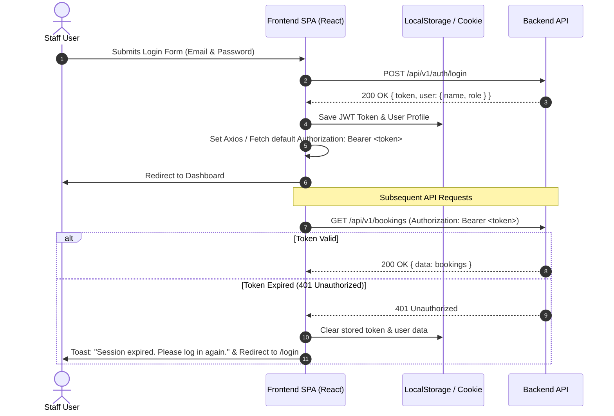

# Frontend Project Brief & API Integration Guide

This document serves as the **single source of truth** for the frontend engineering team to design, build, and integrate the user interface with the **Hotel Management System RESTful API**.

---

## 1. Project Overview

- **System Name**: Hotel Management System (HMS)
- **Purpose**: Automate and streamline day-to-day hotel operations, including room inventory management, guest registration, reservation scheduling, automated availability checking, check-in/check-out workflows, and financial revenue reporting.
- **Target Users**: Front Desk Receptionists, Hotel Administrators, and Housekeeping Staff.
- **Key Value Proposition**: Eliminates double-booking errors, provides real-time room status visibility, accelerates guest turnaround, and delivers accurate business intelligence.

---

## 2. User Roles & Permission Matrix

The backend enforces Role-Based Access Control (RBAC). The frontend should adapt its navigation and UI elements accordingly:

| Feature / Action | Admin | Receptionist | Housekeeping |
|---|:---:|:---:|:---:|
| **Staff & User Management** | ✅ Full Access | ❌ Hidden | ❌ Hidden |
| **Room Inventory (Add/Edit/Delete)** | ✅ Full Access | 👁️ Read Only | 👁️ Read Only |
| **Room Status Updates (`cleaning` $\to$ `available`)** | ✅ Full Access | ✅ Can Update | ✅ Can Update |
| **Guest Profiles (CRUD)** | ✅ Full Access | ✅ Full Access | ❌ Hidden |
| **Bookings & Availability Search** | ✅ Full Access | ✅ Full Access | ❌ Hidden |
| **Check-In & Check-Out Operations** | ✅ Full Access | ✅ Full Access | ❌ Hidden |
| **Occupancy Reports** | ✅ Full Access | ✅ View Only | ❌ Hidden |
| **Revenue & Financial Analytics** | ✅ Full Access | ❌ Hidden | ❌ Hidden |

---

## 3. Core Features to Implement

| Feature | Description |
|---|---|
| **Authentication** | Secure staff login/logout with JWT Bearer tokens and auto-logout on session expiration. |
| **Live Dashboard** | Real-time overview of available/occupied rooms, upcoming check-ins/outs, and monthly revenue. |
| **Room Inventory Management** | Table/card views with filter tags (status, floor, type) and modal forms for adding/editing rooms. |
| **Guest Directory** | Customer list with full-text search (Name, Email, Phone, Passport/ID) and booking history. |
| **Booking & Availability Calendar** | Real-time date-range room availability lookup and reservation creation with pricing calculator. |
| **Check-In Workflow** | Fast intake process: verify guest ID, allocate/confirm room, and transition room to `occupied`. |
| **Check-Out & Invoicing** | Automated bill calculation (nights stay, deposits paid, balance due), and mark room for `cleaning`. |
| **Reports & Analytics** | Interactive graphs for daily/monthly occupancy rates and revenue by payment method. |

---

## 4. Required Pages & Screen Flows

```
  ┌─────────────────────────────────────────────────────────────┐
  │                         LOGIN PAGE                          │
  └──────────────────────────────┬──────────────────────────────┘
                                 │ Authenticated
                                 ▼
  ┌─────────────────────────────────────────────────────────────┐
  │                   MAIN APPLICATION LAYOUT                   │
  │  ┌───────────────┬───────────────────────────────────────┐  │
  │  │ Sidebar Nav   │  1. Dashboard Overview                │  │
  │  │ - Dashboard   │  2. Rooms (Table + Filter + Add/Edit) │  │
  │  │ - Rooms       │  3. Guests Directory                  │  │
  │  │ - Guests      │  4. Bookings & Calendar               │  │
  │  │ - Bookings    │  5. Check-In / Check-Out Stations     │  │
  │  │ - Check-In/Out│  6. Reports & Analytics (Admin/Recep) │  │
  │  │ - Reports     │  7. User Management (Admin Only)      │  │
  │  │ - Staff (Adm) │                                       │  │
  │  └───────────────┴───────────────────────────────────────┘  │
  └─────────────────────────────────────────────────────────────┘
```

1. **Login Screen**: Clean, responsive login card with email & password validation.
2. **Dashboard**: Metrics widgets (Total Rooms, Available, Occupied, Today's Check-ins, Monthly Revenue).
3. **Rooms Management**: Color-coded room grid/table, status switcher (`available`, `occupied`, `cleaning`, `maintenance`), and category manager.
4. **Guests Directory**: Data table with live debounced search and drawer profile view.
5. **Bookings & Calendar**: Date picker range selector, room picker, and reservation summary.
6. **Check-In Station**: Quick search for pending/confirmed bookings by name or reference code.
7. **Check-Out Station**: Invoice summary showing total cost, deposits made, and payment collector.
8. **Reports Page**: Interactive charts (Recharts / Chart.js) for occupancy rates and revenue breakdown.
9. **User / Staff Management (Admin Only)**: Staff account creation, role assignment, and deactivation.

---

## 5. Backend API Integration & Endpoints

### 5.1 Base URLs
- **Development**: `http://localhost:8080/api/v1`
- **Production**: `https://api.hotel-system.com/api/v1`

### 5.2 Standard Response Envelope Format
All endpoints return a uniform response envelope:
```json
{
  "success": true,
  "message": "Operation completed successfully",
  "data": {},
  "error": null
}
```

### 5.3 Key API Endpoints Master Reference

| Module | Method | Endpoint | Access / Role | Description |
|---|---|---|---|---|
| **Auth** | `POST` | `/auth/login` | Public (Rate-limited) | Login; returns JWT token + user profile |
| **Auth** | `GET` | `/auth/me` | Authenticated | Retrieve current user profile |
| **Rooms** | `GET` | `/rooms` | Authenticated | List rooms (query: `status`, `floor`, `room_type_id`) |
| **Rooms** | `GET` | `/rooms/available` | Authenticated | Check availability (query: `check_in`, `check_out`) |
| **Rooms** | `POST` | `/rooms` | `Admin` | Create a new physical room |
| **Rooms** | `PUT` | `/rooms/:id` | `Admin` | Update room properties |
| **Rooms** | `PATCH`| `/rooms/:id/status` | `Admin, Receptionist, Housekeeping` | Update status (e.g. `cleaning` $\to$ `available`) |
| **Rooms** | `DELETE`| `/rooms/:id` | `Admin` | Delete room |
| **Guests** | `GET` | `/guests` | `Admin, Receptionist` | List all guests (query: `search`) |
| **Guests** | `GET` | `/guests/:id` | `Admin, Receptionist` | Get guest profile & booking history |
| **Guests** | `POST` | `/guests` | `Admin, Receptionist` | Register a new guest |
| **Guests** | `PUT` | `/guests/:id` | `Admin, Receptionist` | Update guest details |
| **Bookings** | `GET` | `/bookings` | `Admin, Receptionist` | List bookings (query: `status`, `guest_id`, `from`, `to`) |
| **Bookings** | `GET` | `/bookings/:id` | `Admin, Receptionist` | Get booking details |
| **Bookings** | `GET` | `/bookings/reference/:ref` | `Admin, Receptionist`| Lookup booking by reference code |
| **Bookings** | `POST` | `/bookings` | `Admin, Receptionist` | Create reservation (atomic date conflict check) |
| **Bookings** | `PUT` | `/bookings/:id` | `Admin, Receptionist` | Modify booking dates or room allocation |
| **Bookings** | `POST` | `/bookings/:id/check-in` | `Admin, Receptionist` | Process check-in (marks room `occupied`) |
| **Bookings** | `POST` | `/bookings/:id/check-out` | `Admin, Receptionist` | Process check-out (marks room `cleaning`, bill) |
| **Bookings** | `POST` | `/bookings/:id/cancel` | `Admin, Receptionist` | Cancel reservation and release room lock |
| **Bookings** | `POST` | `/bookings/payments` | `Admin, Receptionist` | Record a payment transaction |
| **Reports** | `GET` | `/reports/occupancy` | `Admin, Receptionist` | Real-time & period occupancy metrics |
| **Reports** | `GET` | `/reports/revenue` | `Admin` | Financial revenue breakdown by payment method |
| **Staff** | `GET` | `/staff` | `Admin` | List all staff members |
| **Staff** | `POST` | `/staff` | `Admin` | Create a new staff account with role |

---

## 6. TypeScript Data Models & Interfaces

```typescript
// 1. User & Authentication
export type UserRole = 'admin' | 'receptionist' | 'housekeeping';

export interface User {
  id: number;
  name: string;
  email: string;
  role: UserRole;
  is_active: boolean;
  created_at: string;
}

export interface AuthResponse {
  token: string;
  user: User;
}

// 2. Room & Room Types
export type RoomStatus = 'available' | 'booked' | 'occupied' | 'cleaning' | 'maintenance';

export interface RoomType {
  id: number;
  name: string;
  base_price_per_night: number;
  capacity: number;
  description?: string;
  amenities?: string;
}

export interface Room {
  id: number;
  room_number: string;
  room_type_id: number;
  room_type?: RoomType;
  floor: number;
  status: RoomStatus;
  is_active: boolean;
  created_at: string;
}

// 3. Guest Profile
export interface Guest {
  id: number;
  first_name: string;
  last_name: string;
  email: string;
  phone: string;
  id_card_or_passport: string;
  address?: string;
  created_at: string;
}

// 4. Booking & Lifecycle
export type BookingStatus = 'pending' | 'confirmed' | 'checked_in' | 'checked_out' | 'cancelled';

export interface Booking {
  id: number;
  booking_reference: string;
  guest_id: number;
  guest?: Guest;
  room_id: number;
  room?: Room;
  check_in_date: string;  // YYYY-MM-DD
  check_out_date: string; // YYYY-MM-DD
  actual_check_in?: string;
  actual_check_out?: string;
  total_price: number;
  status: BookingStatus;
  special_requests?: string;
  created_by_id: number;
  created_by?: User;
  payments?: Payment[];
  created_at: string;
}

// 5. Payments & Invoicing
export type PaymentMethod = 'cash' | 'credit_card' | 'debit_card' | 'bank_transfer';
export type PaymentStatus = 'pending' | 'completed' | 'refunded';

export interface Payment {
  id: number;
  booking_id: number;
  amount: number;
  payment_method: PaymentMethod;
  payment_status: PaymentStatus;
  transaction_code: string;
  notes?: string;
  created_at: string;
}

// 6. Reporting Models
export interface OccupancyReport {
  total_rooms: number;
  available_rooms: number;
  occupied_rooms: number;
  cleaning_rooms: number;
  maintenance_rooms: number;
  occupancy_rate_percentage: number;
}

export interface RevenueReport {
  total_revenue: number;
  total_bookings: number;
  completed_stays: number;
  cancelled_stays: number;
  cash_revenue: number;
  card_revenue: number;
  transfer_revenue: number;
}
```

---

## 7. UI/UX Design Guidelines

- **Visual Theme & Typography**: Professional, modern palette with high contrast. Use clean sans-serif typography (`Inter`, `Plus Jakarta Sans`, or `Outfit`).
- **Color-Coded Status Tokens**:
  - 🟢 **`available`**: Emerald / Green (`#10B981`)
  - 🔵 **`booked` / `confirmed`**: Blue (`#3B82F6`)
  - 🔴 **`occupied` / `checked_in`**: Rose / Red (`#EF4444`)
  - 🟡 **`cleaning`**: Amber / Yellow (`#F59E0B`)
  - ⚪ **`maintenance`**: Slate / Grey (`#64748B`)
- **Key UI Elements**:
  - Sticky sidebar navigation displaying the logged-in staff member's avatar and role badge.
  - Interactive date range picker with live price preview calculation.
  - Toast feedback for actions (e.g. *"Room 101 successfully marked as Available"*).
  - Confirmation modals for critical operations (e.g. cancelling a booking or decommissioning a room).
  - Skeleton placeholders during data fetching.

---

## 8. Authentication & Interceptor Flow



---

## 9. Error Handling Strategy

| HTTP Status | Meaning | Recommended Frontend Action |
|---|---|---|
| **`200 / 201`** | Success | Show success toast, update local state / invalidate query cache. |
| **`400`** | Validation Error | Highlight invalid inputs and display field-specific error messages. |
| **`401`** | Unauthorized | Wipe local session token and redirect user to `/login`. |
| **`403`** | Forbidden | Show "Access Denied - Insufficient Permissions" banner/modal. |
| **`404`** | Not Found | Display empty state or "Resource Not Found" placeholder. |
| **`409`** | Conflict (Double-Booking) | Show alert: *"This room is already reserved for the selected dates. Please choose another room."* |
| **`429`** | Rate Limit Exceeded | Toast: *"Too many requests. Please wait a moment."* |
| **`500`** | Server Error | Display friendly error message with retry button. |

---

## 10. Suggested Frontend Directory Layout

```
src/
├── api/                        # Axios instance & endpoint service functions
│   ├── client.ts               # Axios interceptor for JWT injection & 401 redirect
│   ├── auth.api.ts
│   ├── rooms.api.ts
│   ├── guests.api.ts
│   ├── bookings.api.ts
│   └── reports.api.ts
├── components/                 # Reusable UI component library
│   ├── common/                 # Button, Input, Modal, Badge, Toast, Table
│   ├── layout/                 # Sidebar, Header, PageContainer
│   └── guards/                 # ProtectedRoute, RoleGuard
├── pages/                      # Application route screens
│   ├── auth/                   # LoginPage.tsx
│   ├── dashboard/              # DashboardPage.tsx
│   ├── rooms/                  # RoomsListPage.tsx, RoomFormModal.tsx
│   ├── guests/                 # GuestsListPage.tsx, GuestDetailsDrawer.tsx
│   ├── bookings/               # BookingsCalendarPage.tsx, CreateBookingModal.tsx
│   ├── checkin-checkout/       # CheckInPage.tsx, CheckOutInvoiceModal.tsx
│   ├── reports/                # ReportsPage.tsx (Occupancy & Revenue Charts)
│   └── staff/                  # StaffManagementPage.tsx (Admin only)
├── hooks/                      # Custom hooks (useAuth, useRooms, useDebounce)
├── context/                    # AuthContext & ThemeContext
├── types/                      # TypeScript definitions (from Section 6)
├── utils/                      # Date formatters (date-fns), currency formatters
└── styles/                     # Tailwind CSS / CSS Modules / Theme tokens
```

---

## 11. Environment Configuration

Create a `.env` file in the frontend root:

```env
# Backend API Base URL
VITE_API_BASE_URL=http://localhost:8080/api/v1

# Request Timeout (30 seconds)
VITE_API_TIMEOUT=30000
```

---

## 12. Phased Implementation Roadmap

```
  ┌─────────────────────────────────────────────────────────────┐
  │  PHASE 1: Core System Foundation                            │
  │  - Auth flow (Login/Logout, Token persistence, Role Guards) │
  │  - Dashboard with summary metrics                           │
  │  - Room Management (List + Add/Edit + Status filters)       │
  │  - Guest Management (List + Create + Search)               │
  │  - Bookings List & Date-Range Availability Picker           │
  └──────────────────────────────┬──────────────────────────────┘
                                 │
                                 ▼
  ┌─────────────────────────────────────────────────────────────┐
  │  PHASE 2: Front Desk Operations & Invoicing                 │
  │  - Check-in station (Booking lookup -> Room Occupied)       │
  │  - Check-out station (Balance calculation -> Invoice view)  │
  │  - Payment recording (Cash / Card / Transfer)               │
  │  - Housekeeping room status workflow (Cleaning -> Available)│
  └──────────────────────────────┬──────────────────────────────┘
                                 │
                                 ▼
  ┌─────────────────────────────────────────────────────────────┐
  │  PHASE 3: Analytics & Administration                        │
  │  - Interactive Revenue & Occupancy Charts                   │
  │  - Staff User Management (Admin only)                       │
  │  - Print invoice / PDF export                               │
  └─────────────────────────────────────────────────────────────┘
```

---

## 13. Frontend Testing Requirements

- **Unit Tests**: Form validation schemas, date calculation helpers, currency formatters.
- **Component Tests**: Render states (loading skeletons, error alerts, empty states, table pagination).
- **Integration & E2E Tests**:
  1. Staff logs in with valid credentials $\to$ lands on Dashboard.
  2. Front Desk searches room availability for given dates $\to$ creates booking with guest information.
  3. Receptionist completes Check-In $\to$ room updates to `occupied`.
  4. Receptionist completes Check-Out $\to$ invoice renders balance due $\to$ room transitions to `cleaning`.
  5. Housekeeper updates room status $\to$ room returns to `available`.

---

## 14. Production Deployment Checklist

- [ ] Set `VITE_API_BASE_URL` to production backend API domain (`https://api.hotel-system.com/api/v1`).
- [ ] Ensure backend CORS allows production frontend domain.
- [ ] Serve application over HTTPS with HTTP Strict Transport Security (HSTS).
- [ ] Implement client-side error boundaries to prevent application crashes.
- [ ] Configure asset compression and caching headers for static builds.
