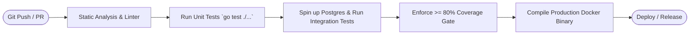

# Testing & QA Strategy for Hotel Management API

This document details the comprehensive testing and quality assurance strategy for the **Hotel Management System Backend**, covering unit tests, database integration tests, HTTP endpoint integration tests, mock vs. real database strategies, performance optimizations, and CI/CD pipelines.

---

## 1. Testing Pyramid & Test Levels

```
                     ┌───────────────────────┐
                     │   Manual & Postman    │  ~10% of testing effort
                     │       E2E Tests       │  Full system & user workflows
                     ├───────────────────────┴───────────────────────┐
                     │          Integration Tests                    │  ~20-30% of testing effort
                     │  - HTTP Handlers via httptest                 │  Tests routing, middleware,
                     │  - Real DB operations on test container       │  GORM queries, transactions
                     ├───────────────────────────────────────────────┴───────────────────────────────┐
                     │                      Unit Tests                                              │  ~60-70% of testing effort
                     │  - Table-driven tests for Services, Password Hashing, JWT Tokens, Pricing    │  Fast, isolated,
                     │  - Pure Go business logic & mock repositories                                │  zero I/O dependencies
                     └──────────────────────────────────────────────────────────────────────────────┘
```

---

## 2. Mock vs. Real Database Testing Strategy

```
┌───────────────────────────────────────┬─────────────────────────────────────────────────────────┐
│ Mock Database Testing (Unit Tests)   │ Real Database Testing (Integration Tests)               │
├───────────────────────────────────────┼─────────────────────────────────────────────────────────┤
│ • Uses mock structs (implements repo) │ • Uses isolated SQLite in-memory or Postgres container  │
│ • Runs in milliseconds                │ • Validates real SQL syntax, GORM Preload, and indexes  │
│ • Tests business logic branching      │ • Validates foreign key constraints & cascading deletes │
│ • Validates error propagation         │ • Validates atomic transactions (ROLLBACK / COMMIT)     │
└───────────────────────────────────────┴─────────────────────────────────────────────────────────┘
```

---

## 3. Test Coverage Goals & Target Metrics

| Module / Component | Target Line Coverage | Critical Path Verification |
|---|:---:|---|
| **Auth & Security** (`pkg/utils`, `middleware`) | $\ge 90\%$ | Bcrypt hashing, JWT generation/expiration, RBAC role guard |
| **Booking Service** (`internal/service`) | $\ge 85\%$ | Double-booking prevention, overlap dates, check-in/out transitions |
| **Room Service & Repos** (`internal/repository`)| $\ge 80\%$ | Availability date queries, status filtering |
| **HTTP Handlers** (`internal/handler`) | $\ge 80\%$ | Status codes (`200`, `201`, `400`, `401`, `403`, `409`), response body formats |
| **Overall Codebase** | $\ge \mathbf{80\%}$ | Complete automated test pipeline verification |

---

## 4. Sample Test Scenarios & Edge Cases Matrix

### 4.1 Authentication & Authorization Scenarios
| Scenario ID | Test Name | Request / Action | Expected Result |
|---|---|---|---|
| `AUTH-01` | Valid Login | Valid email & correct password | `200 OK`, returns valid signed JWT token |
| `AUTH-02` | Invalid Password | Valid email & wrong password | `401 Unauthorized` |
| `AUTH-03` | Expired Token | Request with expired JWT token | `401 Unauthorized` |
| `AUTH-04` | Role Guard (Forbidden) | Housekeeper requesting `/api/v1/reports/revenue` | `403 Forbidden` |
| `AUTH-05` | Role Guard (Allowed) | Admin requesting `/api/v1/staff` | `200 OK` |

### 4.2 Room & Availability Scenarios
| Scenario ID | Test Name | Request / Action | Expected Result |
|---|---|---|---|
| `ROOM-01` | Check Availability (Open) | Dates with no existing reservations | Returns all active rooms |
| `ROOM-02` | Check Availability (Booked)| Dates overlapping confirmed booking | Excludes reserved room from result |
| `ROOM-03` | Status Filter | Query `status=available` | Returns only rooms with status available |
| `ROOM-04` | Maintenance Filter | Room marked `maintenance` | Excluded from public available list |

### 4.3 Booking & Operations Lifecycle Scenarios
| Scenario ID | Test Name | Request / Action | Expected Result |
|---|---|---|---|
| `BOOK-01` | Valid Booking Creation | Future dates, valid room and guest | `201 Created`, booking confirmed |
| `BOOK-02` | Zero Nights Booking | `check_in == check_out` | `400 Bad Request` (Min 1 night required) |
| `BOOK-03` | Inverted Date Range | `check_out < check_in` | `400 Bad Request` |
| `BOOK-04` | Double-Booking Prevention | Book room during overlapping dates | `409 Conflict` (Room already booked) |
| `BOOK-05` | Check-in Valid | Booking in `confirmed` status | `200 OK`, booking $\to$ `checked_in`, room $\to$ `occupied` |
| `BOOK-06` | Check-in Invalid | Booking in `cancelled` status | `400 Bad Request` |
| `BOOK-07` | Check-out Valid | Booking in `checked_in` status | `200 OK`, booking $\to$ `checked_out`, room $\to$ `cleaning`, returns invoice |

---

## 5. Automated Table-Driven Test Example (Service Layer)

```go
func TestCreateBookingTableDriven(t *testing.T) {
    tests := []struct {
        name         string
        checkInDate  string
        checkOutDate string
        roomID       uint
        expectError  bool
        expectedErr  string
    }{
        {
            name:         "Valid reservation for 3 nights",
            checkInDate:  "2026-09-01",
            checkOutDate: "2026-09-04",
            roomID:       1,
            expectError:  false,
        },
        {
            name:         "Invalid zero-night reservation",
            checkInDate:  "2026-09-01",
            checkOutDate: "2026-09-01",
            roomID:       1,
            expectError:  true,
            expectedErr:  "check_out_date must be after check_in_date",
        },
        {
            name:         "Invalid inverted date range",
            checkInDate:  "2026-09-10",
            checkOutDate: "2026-09-05",
            roomID:       1,
            expectError:  true,
            expectedErr:  "check_out_date must be after check_in_date",
        },
        {
            name:         "Overlapping double-booking attempt",
            checkInDate:  "2026-09-02",
            checkOutDate: "2026-09-06",
            roomID:       1,
            expectError:  true,
            expectedErr:  "selected room is already booked for these dates",
        },
    }

    for _, tt := range tests {
        t.Run(tt.name, func(t *testing.T) {
            // Test execution against in-memory repository
        })
    }
}
```

---

## 6. Performance & Scale Optimizations

1. **Database Indexing**:
   - `idx_bookings_dates` on `(check_in_date, check_out_date)` avoids full table scans during availability queries.
   - `idx_rooms_status` on `rooms(status)` enables indexed status lookups.
   - `idx_guests_email` and `idx_guests_id_number` for quick front-desk guest checks.
2. **Pagination & Query Limits**:
   - `limit` and `page` parameters are applied to list endpoints (`/api/guests`, `/api/bookings`, `/api/rooms`) to keep response payloads small and fast.
3. **Connection Pooling**:
   - Configured GORM connection pool with `SetMaxOpenConns(100)`, `SetMaxIdleConns(10)`, and `SetConnMaxLifetime(time.Hour)`.

---

## 7. CI/CD Automated Testing Pipeline

Automated pipeline runs on every pull request to ensure high quality before merging:


